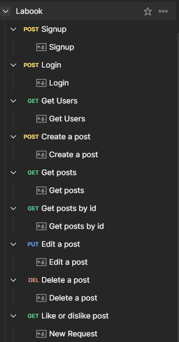

# Labook API



API para gerenciar o banco de dados de uma rede social, incluindo usuários e postagens.

Para os usuários, a API permite o cadastro como um novo usuário, o login como um usuário existente e a obtenção das informações de todos os usuários se a conta for do tipo "ADMIN".

Para as postagens, a API permite a criação, busca, edição, exclusão, curtida e descurtida das postagens existentes no banco de dados.

[Visualize a documentação](https://documenter.getpostman.com/view/26594102/2s9YJW7S3a)

## Índice
- <a href="#funcionalidades">Funcionalidades da Aplicação</a>
- <a href="#executar">Como Executar a Aplicação</a>
- <a href="#endpoints">Endpoints da Aplicação</a>
- <a href="#tecnologias-utilizadas">Tecnologias Utilizadas</a>
- <a href="#desenvolvedor">Desenvolvedor(a)</a>

## Funcionalidades da Aplicação
 - [x]  Signup  
 - [x]  Login
 - [x]  Get users
 - [x]  Create post
 - [x]  Get posts 
 - [x]  Edit post by ID
 - [x]  Delete post by ID
 - [x]  Get post by ID
 - [x]  Like and dislike post by ID


## Como Executar a Aplicação
```bash
# Clone este repositório
$ git clone link-do-repo

# Acesse a pasta da aplicação no terminal
$ cd labook-project

# Instale as dependências
$ npm install

# Execute a aplicação
$ npm run dev
```

## Application endpoints

1. Endpoints for the users table:
 - Get users: 
    - app.get => 'http://localhost:3003/users';
 - Signup
    - app.post => 'http://localhost:3003/users/signup';
 - Login
    - app.post => 'http://localhost:3003/users/login'.

2. Endpoints for the posts table:
 - Create post
    - app.post => 'http://localhost:3003/posts';
 - Get posts
    - app.get => 'http://localhost:3003/posts';
 - Edit post by id
    - app.put =>'http://localhost:3003/posts/:id';
 - Delete post by id
    - app.delete => 'http://localhost:3003/posts/:id';
 - Like and dislike post by id
    - app.put => 'http://localhost:3003/posts/:id/like'.


1. TypeScript
2. [Node.js](https://nodejs.org/en)
3. [Express](https://expressjs.com/pt-br/)
4. SQL
5. [SQLite](https://www.sqlite.org/index.html)
6. [Knex](https://knexjs.org/)
7. Object-Oriented Programming (OOP)
8. [UUID](https://www.uuidgenerator.net/)
9. [Zod](https://zod.dev/)
10. [Json Web Token](https://jwt.io/)
11. Layered Architecture

## Developer
[LinkedIn](https://www.linkedin.com/in/gleicielen-dourado/)


